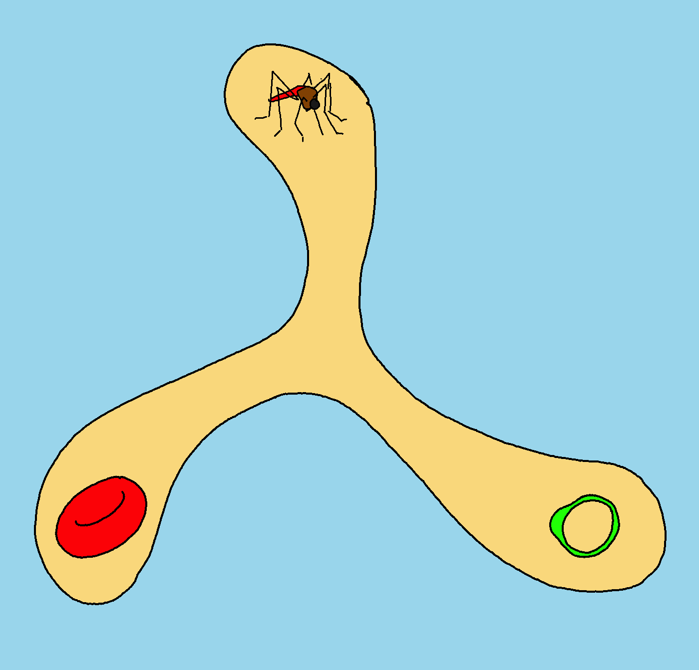

# Pv3Rs 

An R package for *Plasmodium vivax* molecular correction via statistical genetic
inference of *P. vivax*

[//]: # (use same order as software note abstract)

- Relapse
- Recrudescence
- Reinfection

The core function, `compute_posterior()`, computes per-person posterior
probabilities of relapse, recrudescence, and reinfection (recurrence states)
using *P. vivax* genetic data on two or more episodes. To fully understand the
core function, in addition to reading this README in its entirety and the
pre-print cited below, we recommend reading the `vignette("demonstrate-usage",
"Pv3Rs")` and 
[Understand posterior estimates](https://aimeertaylor.github.io/Pv3Rs/articles/understand-posterior.html).

Two other important features:

- `plot_data()` visualises genetic data for molecular
correction, regardless of the analytical method (e.g., *Plasmodium falciparum* 
data intended for analysis using a WHO match-counting algorithm).

- `plot_simplex()` can be used to visualise per-recurrence
probabilities of relapse, recrudescence, and reinfection, or any other
probability triplet summing to one.

## Please be aware of the following points!

The Pv3Rs R package is not yet peer-reviewed and thus liable to modification.
The model is described in a preprint [1], building on a prototype in [2].

[1] [Taylor, Foo & White, 2022](https://www.medrxiv.org/content/10.1101/2022.11.23.22282669v1)

[2] [Taylor & Watson et al. 2019](https://www.nature.com/articles/s41467-019-13412-x)

### Prior considerations: 

- Genetic data are modelled using a Bayesian model, whose prior is ideally
informative (in [2] prior estimates were generated by a time-to-event model
built by James Watson) because the cause of recurrent *P. vivax* malaria is not
always identifiable from genetic data alone: when the data are consistent with
recurrent parasites that are relatively unrelated to those in all preceding
infections, both reinfection and relapse are plausible; meanwhile, when the data
are compatible with recurrent parasites that are clones of those in the
preceding infection, both recrudescence and relapse are plausible.

- The main Pv3Rs function, `compute_posterior()`, could be applied to *P. falciparum* by setting the prior
probability of relapse to zero, but genotyping errors, which are not accounted
for under the current Pv3Rs model, are liable to lead to the misclassification
of recrudescence as reinfection when the prior probability of relapse is zero
(and of recrudescence as relapse when the prior probability of relapse exceeds
zero).

### Notable assumptions and limitations: 

As with any model, Pv3Rs makes various assumptions that limit its capabilities in
some settings.

#### Mutually exclusive recurrent states
Recurrence states are modelled as mutually exclusive, suitable for studies where 
participants are actively followed up frequently and where all detected 
infections are treated to the extent that parasitaemia drops 
below some detectable level before recurrence, if recurrence occurs.
In studies with untreated or accumulated infections, outputs may not
be meaningful.

#### Unmodelled complexities 
We do not model all the complexities around molecular correction. For example,
population structure, including household effects; failure to capture
low-density clones in a blood sample of limited volume
[[Snounou & Beck, 1998]](https://doi.org/10.1016/S0169-4758(98)01340-4); and 
hidden biomass the spleen and bone marrow
[[Markus, 2019]](https://doi.org/10.1016/j.pt.2019.08.009). Users must interpret
outputs in context of the study and its methods. For example, we expect Pv3Rs to
output probable relapse if a person is reinfected by a new mosquito but with
parasites that are recently related to those that caused a previous infection,
as might happen in household transmission chains.


#### Sibling misspecification
Relapsing parasites that are siblings of parasites in previous infections can be
meiotic, parent-child-like, regular or half siblings, but we model all sibling
parasites as regular siblings via the following assumptions: 

- Allele inheritance is independent (not true of meiotic siblings)
- Aibling relationships are transitive (not true of parent-child-like trios or some half-sibling trios)
- Alleles of a sibling cluster are drawn from at most two parental alleles (not true of half siblings)

In our experience, half sibling misspecification leads to some misclassification
of relapses as reinfections; see 
[Understand half-sibling misspecification](https://aimeertaylor.github.io/Pv3Rs/articles/understand-half-sibs.html). 
A descriptive study to explore the extent of half-sibling misspecification is 
recommended (an example will be provided in an upcoming manuscript).

#### Observation errors and *de novo* mutations
We do not model undetected alleles, genotyping errors, or *de novo* mutations. 
Recrudescent parasites are modelled as perfect clones under Pv3Rs. As 
such, the posterior probability of recrudescence is rendered zero by errors and 
mutations. This becomes more likely when there are data on more markers. Sensitivity 
analyses that explore the impact of errors and mutations on recurrence state 
estimates are merited.

#### Interpreting probable reinfection and recrudescence
When data are not sufficiently informative to distinguish between recrudescence and 
relapse (or reinfection and relapse), the posterior probabilities of recrudescence and 
relapse (or reinfection and relapse) are heavily influenced by a model assumption over relationship
graphs; see [Understand graph prior ramifications](https://aimeertaylor.github.io/Pv3Rs/articles/understand-graph-prior.html). 
The development of a more biologically-principled generative model on parasite 
relationships is merited.

Limitation | Reason
----------- | ------
Possible misclassification of persistent and/or accumulated states | Modelling recurrent states as mutually exclusive
Possible inconsistency with data on more-and-more markers | Not modelling errors
Possible misclassification of relapse | Half-sibling misspecification and not modelling errors
Possible misclassification of recrudescence | Not modelling errors
Possible misclassification of reinfection | Not modelling population structure
Strong prior impact on posterior | Recurrent states are not always identifiable from genetic data alone


### Computational limits:

- Pv3Rs scales to hundreds of markers but not whole-genome sequence (WGS) data.  

- We do not recommend running `compute_posterior()` for data whose total
genotype count (sum of per-episode multiplicities of infection) exceeds eight.
If the total genotype counts exceeds eight but there are multiple recurrences,
it might be possible to generate recurrent state estimates by analysing episodes
pairwise (this approach was used in [2] and we're working currently on an
improved version).

- The per-marker allele limit of `compute_posterior()` is untested. 
Very high marker cardinalities could lead to very small allele frequencies and 
thus some underflow problems. 


### Population-level allele frequencies: 

In addition to *P. vivax* allelic data on two or more episodes,
`compute_posterior()` requires as input population-level allele frequencies. To
minimise bias due to within-host selection of recrudescent parasites, we
recommend using only enrolment episodes to estimate population-level allele
frequencies, and ideally enrolment episodes from study participants selected at
random, not only study participants who experience recurrence. That said, if
most recurrences are either reinfections or relapses, both of which are draws
from the mosquito population (albeit a delayed draw in the case of a relapse),
assuming there is no systematic within-patient selection (as might occur when
infections encounter lingering drug pressure), estimates based on all episodes
should be unbiased and more precise than those based on enrolment episodes only.

### Read-count data: 

Unfortunately, the Pv3Rs model does not exploit data on read counts at present.
However, read-count data could be used to compute population-level allele
frequencies, assuming they are not biased by experimental artefacts.


## Installation 

```r
# Install or update devtools from CRAN
install.packages("devtools")

# Install R.rsp, required for LaTeX vignette building
install.packages("R.rsp")

# Install Pv3Rs from GitHub 
# We recommend doing this in RStudio: RStudio installs pandoc, required for
# vignette building. If not, you might need to install pandoc and check its
# path; otherwise set build_vignettes = FALSE
devtools::install_github("aimeertaylor/Pv3Rs", build_vignettes = TRUE)

# Load and attach Pv3Rs
library(Pv3Rs)

# List links to all available documentation
help(package = "Pv3Rs")

# List links to vignettes
vignette(package = "Pv3Rs")

# View function documentation, e.g., 
?compute_posterior
```
