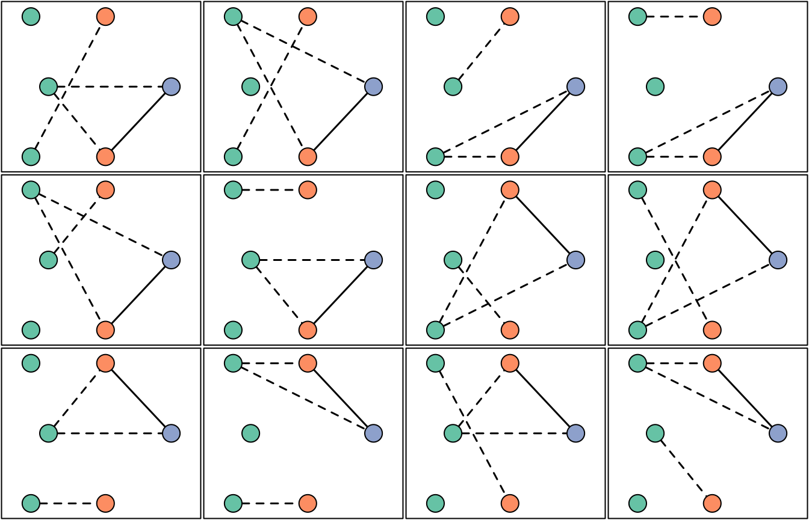

# Demonstrate Pv3Rs usage

This vignette demonstrates the basic `Pv3Rs` workflow for a single study
participant:

1.  Plot data
2.  Compute recurrence state posterior probabilities
3.  Plot per-recurrence probabilities

We also show how to explore relationship graphs and their log
likelihoods. For a general understanding of posterior probabilities, see
[Understand posterior
probabilities](https://aimeertaylor.github.io/Pv3Rs/articles/posterior-probabilities.html).
A tutorial demonstrating the `Pv3Rs` workflow at the study-level is
planned; we plan to cover

- Generating pairwise probabilities when the total genotype count over
  multiple recurrences exceeds eight
- Computing false discovery rates
- Sensitivity analysis for genotyping errors
- Sensitivity analysis for sibling misspecification
- Alternative approach using genetic distance and whole-genome sequence
  data
- Using posterior probabilities (rather than categorical
  classifications) in downstream analyses
- Estimating false negative rates

## Basic workflow

We begin with a synthetic example of three episodes (episode names are
optional) with three markers (marker names are obligatory) whose alleles
have known frequencies, `fs`.

``` r
y <- list("Enrolment" = list(m1 = c('b','c','d'), 
                              m2 = c('a','b'),
                              m3 = c('b','c','d')),
          "Recurrence 1" = list(m1 = c('b','d'), 
                                m2 = c('a'), 
                                m3 = c('a','b')),
          "Recurrence 2" = list(m1 = c('d'), 
                                m2 = c('a'), 
                                m3 = c('a')))

fs <- list(m1 = c(a = 0.27, b = 0.35, c = 0.18, d = 0.20),
           m2 = c(a = 0.78, b = 0.14, c = 0.07, d = 0.01),
           m3 = c(a = 0.21, b = 0.45, c = 0.26, d = 0.08))
```

### 1) Plot data

We plot the data using
[`plot_data()`](https://aimeertaylor.github.io/Pv3Rs/reference/plot_data.md).

``` r
plot_data(ys = list("Participant data" = y), fs = fs)
```


For each marker, different colours represent different alleles. The
legend below the main grid shows per-marker allele frequencies via
colour proportions, with one row per marker, ordered as in the main
grid; e.g., `d` at `m2` is rare.

The most parsimonious MOI estimates compatible with the above data, 3,
2, 1, are computed using
[`determine_MOIs()`](https://aimeertaylor.github.io/Pv3Rs/reference/determine_MOIs.md).
The total genotype count (sum over MOIs) is 6.

**Aside** In this synthetic example, markers are quart-allelic, imposing
low upper bounds on MOI estimates based on maximum per-marker allele
counts. More diverse markers are recommended for MOI estimation and
recurrence state inference.

### 2) Compute recurrence state posterior probabilities

The bulk of the computational time lies in computing log-likelihoods of
graphs of relationships between genotypes. The number of graphs depends
on the MOIs. By default, `compute_posterior` uses MOI estimates
generated by `determine_MOIs`.

``` r
post <- compute_posterior(y, fs)
#> Number of valid relationship graphs (RGs) is 1315
#> =============================================================================|
#> Computing log p(Y|RG) for 1315 RGs
#> =============================================================================|
#> Finding log-likelihood of each vector of recurrence states
#> =============================================================================|
```

**Aside** We do not recommend running
[`compute_posterior()`](https://aimeertaylor.github.io/Pv3Rs/reference/compute_posterior.md)
for data whose total genotype count (sum over MOIs) exceeds eight. That
said, we have not encoded a hard limit. In our experience, it is
possible, but very long, to generate posterior probabilities using data
with a total genotype count up to 10; above 10, calls to
[`compute_posterior()`](https://aimeertaylor.github.io/Pv3Rs/reference/compute_posterior.md)
are liable cause memory-use problems and fail.

In the call to
[`compute_posterior()`](https://aimeertaylor.github.io/Pv3Rs/reference/compute_posterior.md)
above we did not specify a prior, and so by default all three recurrence
states were assumed equally likely per recurrence.

Posterior probabilities of recurrent state sequences (where `C` is
recrudescence, `L` is relapse, and `I` is reinfection) are stored in
`post$joint`. Here, we find the most likely sequence of recurrence
states is IC with posterior probability 0.4568:

``` r
sort(post$joint, decreasing = T)
#>         IC         LC         IL         LL         II         LI         CC 
#> 0.45682305 0.21338194 0.15385932 0.08501504 0.05986209 0.03105856 0.00000000 
#>         CL         CI 
#> 0.00000000 0.00000000
```

Per-recurrence posterior probabilities of recrudescence `C`, relapse
`L`, and reinfection `I` are stored in `post$marg`.

``` r
post$marg
#>                     C         L          I
#> Recurrence 1 0.000000 0.3294555 0.67054446
#> Recurrence 2 0.670205 0.2388744 0.09092065
```

We refer to per-recurrence probabilities as `marg` (shorthand for
marginal) because they are computed by simply summing over state
sequence probabilities. For example, the probability of `L` at
`Recurrence 1` above is the sum of probabilities over `LC`, `LL` and
`LI`:

``` r
post$joint["LC"] + post$joint["LL"] + post$joint["LI"]
#>        LC 
#> 0.3294555
```

### 3) Plot per-recurrence probabilities

Per-recurrence posterior probabilities are plotted on the simplex using
[`plot_simplex()`](https://aimeertaylor.github.io/Pv3Rs/reference/plot_simplex.md).

``` r
oldpar <- par(no.readonly = TRUE)
par(mar = c(0,0,0,0))
plot_simplex(p.coords = rbind(post$marg, Prior = rep(1/3, 3)), pch = 20)
```


``` r
par(oldpar)
```

The point in the yellow region is most likely a recrudescence with
posterior probability greater than 0.5 (it falls in the bright yellow
region); the point in the red region is most likely a reinfection with
posterior probability greater than 0.5 (it falls in the bright red
region).

## Exploration of relationship graphs

To explore relationship graphs (RGs) and their log-likelihoods, set
`return.RG` and `return.logp` to `TRUE`.

``` r
post <- compute_posterior(y, fs, return.RG = TRUE, return.logp = TRUE)
#> Number of valid relationship graphs (RGs) is 1315
#> =============================================================================|
#> Computing log p(Y|RG) for 1315 RGs
#> =============================================================================|
#> Finding log-likelihood of each vector of recurrence states
#> =============================================================================|
```

We recover the same posterior as before.

``` r
sort(post$joint, decreasing = T)
#>         IC         LC         IL         LL         II         LI         CC 
#> 0.45682305 0.21338194 0.15385932 0.08501504 0.05986209 0.03105856 0.00000000 
#>         CL         CI 
#> 0.00000000 0.00000000
```

But the compute time was longer: to compute the posterior, summations
over per-marker allelic assignments that are equivalent up to
within-episode genotype permutations are redundant. As such, by default,
[`compute_posterior()`](https://aimeertaylor.github.io/Pv3Rs/reference/compute_posterior.md)
does not sum over them, conserving both memory and compute time. The
exploitation of permutation symmetry requires a scheme to choose a
single representative among permutations that are otherwise equivalent.
To compute meaningful graph likelihood values (values that do not depend
on the representative-choosing scheme), all permutations are summed over
when `return.logp = TRUE`, increasing compute time, especially when MOIs
are large. Also, when user-specified MOIs exceed those of
[`determine_MOIs()`](https://aimeertaylor.github.io/Pv3Rs/reference/determine_MOIs.md),
all permutations are summed over because the representative-choosing
scheme is too complicated.

The log-likelihood of each relationship graph is returned. We plot the
relationship graph(s) with the largest likelihood. In this example,
there are two graphs with maximum likelihood; they are isomorphic up to
within-episode genotype permutations.

``` r


# Extract all log likelihoods
llikes <- sapply(post$RGs, function(RG) RG$logp)

# Get maximum log likelihood
mllikes <- max(llikes)

# Extract the relationship graphs (RGs) with the maximum log likelihood
RGs <- post$RGs[which(abs(llikes - mllikes) < .Machine$double.eps^0.5)]

# Plot RGs with maximum log likelihoods
oldpar <- par(no.readonly = TRUE) # Store user's options
par(mar = rep(0.1,4), mfrow = c(1,2))
for(i in 1:length(RGs)) {
  plot_RG(RG_to_igraph(RGs[[i]], determine_MOIs(y)), vertex.size = 20)
  box()
}

# Add a legend
legend("bottomright", pch = 21, 
       pt.bg =  RColorBrewer::brewer.pal(n = 8, "Set2") [1:length(y)], 
       bty = "n", legend = names(y), title = "Episode")
```


``` r

par(oldpar) # Restore user's options
```

Using log likelihoods, we can also find the equivalence class for which
the data are most probable when all relationship graphs in that class
are summed over.

``` r
# In the following code, we place two graphs in the same equivalence class if
# they share the same likelihood. This is not ideal (two graphs that are not
# isomorphic up to permutation could share the same likelihood), but it works
# here: the plot shows only isomorphic graphs within the equivalence class.

sorted_llikes <- sort(llikes, decreasing = T) # Sort log likelihoods
adj_equal <- abs(diff(sorted_llikes, lag = 1)) < .Machine$double.eps^0.5 # Find matches
decr_idxs <- which(adj_equal == FALSE) # Change points: 2, 8, 14, 20, 32, ...
class_sizes <- c(decr_idxs[1], diff(decr_idxs)) # Number of graphs per class

# log likelihood of representative from each 'equivalence class' (EC)
llikes_unique <- sorted_llikes[decr_idxs]

# EC likelihood
class_ps <- exp(llikes_unique)*class_sizes
max_class_p <- which(class_ps == max(class_ps)) # ML EC index 
max_idx <- decr_idxs[max_class_p] # Index of last graph in ML EC
max_size <- class_sizes[max_class_p] # Number of graphs in ML EC

# Plot all graphs within the ML EC 
oldpar <- par(no.readonly = TRUE) # Store user's options
par(mar = rep(0.1,4), mfrow = c(3,4))
RG_order <- order(llikes, decreasing = T) # order RGs by logl
for(i in (max_idx-max_size+1):max_idx) { # EC consists of the RGs with logl rank 21-32
  RG <- post$RGs[[RG_order[i]]]
  RG_igraph <- RG_to_igraph(RG, determine_MOIs(y))
  plot_RG(RG_igraph, vertex.size = 25, vertex.label = NA)
  box()
}
```



``` r
par(oldpar) # Restore user's options
```

**Important considerations**

- The maximum-likelihood graph(s) might not be in the equivalence class
  for which the data are most probable when all relationship graphs in
  that class are summed over (true of the above example).

- The maximum-likelihood graph(s) might be incompatible with the
  maximum-posterior state sequence, (not true of the above example;
  recall the most-likely sequence was IC).

- The graphs in the maximum-likelihood equivalence class might be
  incompatible with the maximum-posterior state sequence (true of the
  above example; the class with the largest likelihood contains graphs
  with sibling edges that are incompatible with IC).
