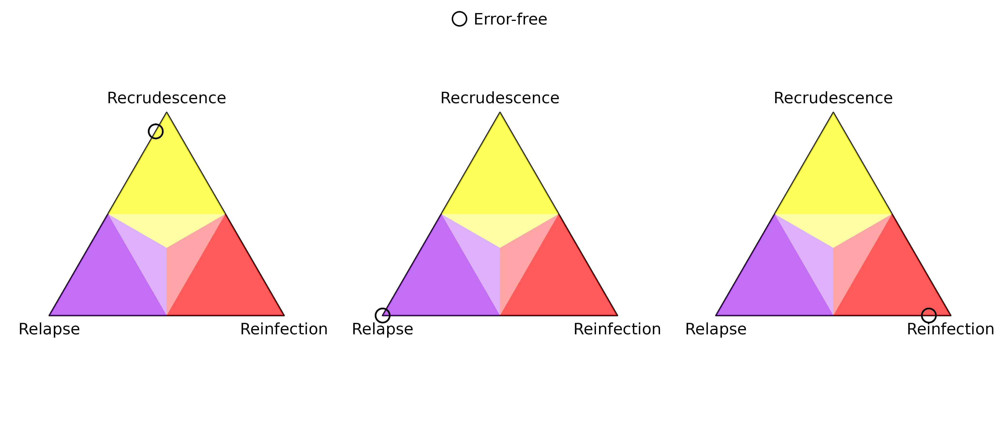
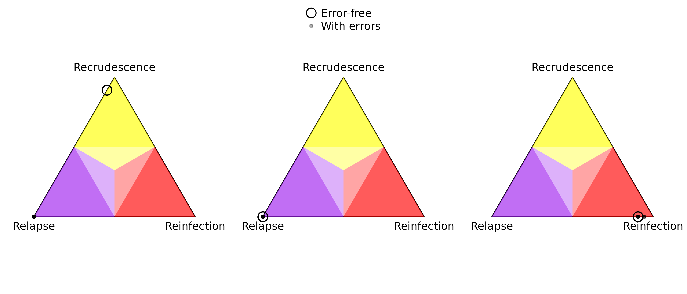
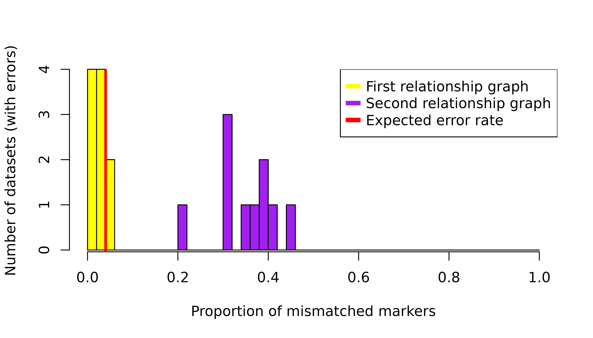

# Understand genotyping errors

## Introduction

Pv3Rs’ statistical model does not account for genotyping errors and *de
novo* mutations, which can lead to misclassification. In this article,
we demonstrate that the primary consequence of such model
misspecifications is the risk of mistaking recrudescence as near-certain
relapse. Intuitively, this is caused by the model’s rigid expectation
for all alleles observed from a recrudescence episode to have been
observed in the preceding episode. If there are *de novo* mutations or
genotyping false positives in the recrudescence episode that lead to
alleles that are not observed in the preceding episode, Pv3Rs will
incorrectly eliminate the possibility of recrudescence. The same applies
in the case of allele dropouts or genotyping false negatives in the
preceding episode.

Mistaking recrudescence as near-certain relapse is inconsequential when
recrudescence and relapse probabilities are combined, e.g., in
estimations of radical cure efficacy. Otherwise, care needs to be taken
when interpreting a near-certain relapse output from Pv3Rs, as it may
correspond to a genuine relapse, or a recrudescence that is obscured by
genotyping errors and/or *de novo* mutations. Assuming a small error
rate and given a sufficient marker count, these two cases can be
distinguished by inspecting the proportion of mismatched markers —
markers that are incompatible with recrudescence because there is some
allele observed in the recurrence that is absent in the preceding
episode. If the proportion of mismatched markers aligns the expected
error rate, one can consider rerunning Pv3Rs without the mismatched
markers. For a genuine relapse, the proportion of mismatched markers
should be higher.

Another consequence of genotyping error, specifically false positives,
is spuriously high multiplicities of infection. Because there is a
computational limit on the total genotype count (we do not recommend
running Pv3Rs on participant data where per-episode multiplicities of
infection sum to nine or more), false positives might render some
recurrences computationally infeasible to be analysed by Pv3Rs. Among
those that are computationally feasible, false postives might impact
probable recrudescence and probable reinfection probabilities because
different parasite genotype counts induce different posterior bounds on
these states (see [Understand graph-prior
ramifications](https://aimeertaylor.github.io/Pv3Rs/articles/graph-prior.pdf)).

## Data simulation

Let us generate some data based on the following three relationship
graphs, each with four genotypes g1, g2, g3, and g4:

``` r
par(mar = c(0, 0.1, 0, 0.1), mfrow = c(1, 3))
suppressMessages(RGs <- enumerate_RGs(c(2, 2)))
for(i in c(2, 6, 34)) {
  plot_RG(RGs[[i]], vertex.size = 20)
}
```


Each relationship graph consists of two parasite genotypes during the
enrolment episode and two parasite genotypes during the recurrence
episode. We’ve chosen these relationship graphs such that only the first
relationship graph is compatible with recrudescence, and only the last
relationship graph is compatible with reinfection. Below is some code to
simulate data based on these relationship graphs. For each relationship
graph, ten data sets are simulated. For each data set, data on 50
octo-allelic markers are simulated per genotype. An internal function
(`Pv3Rs:::recombine_parent_ids`) ensures the finite nature of the
parasite genome (not accounted for under the Pv3Rs model) is captured in
the simulation.

``` r
library(gtools) # for `rdirichlet`

N_CHRS <- 14 # P. vivax has 14 chromosomes

# simulate allele frequencies for multiple markers
# assumes each marker has the same number of alleles
sim_fs <- function(n_m, n_a) {
  markers <- paste0("m", 1:n_m) # marker names
  n_a_vec <- setNames(rep(n_a, n_m), markers)
  lapply(n_a_vec, function(n_a) {
    alleles <- letters[1:n_a] # n_a <= 26
    fs_unnamed <- as.vector(rdirichlet(1, alpha = rep(1, n_a)))
    setNames(fs_unnamed, alleles)
  })
}

sim_RG1 <- function(n_m, n_a) {
  fs <- sim_fs(n_m, n_a)
  init <- lapply(fs, function(f) unique(sample(names(f), 2, TRUE, f)))
  return(list(y = list(init = init, recur = init), fs = fs))
}

sim_RG2 <- function(n_m, n_a) {
  chrs_per_marker <- ceiling((1:n_m)/(n_m+1)*N_CHRS)
  fs <- sim_fs(n_m, n_a)
  parents <- lapply(fs, function(f) sample(names(f), 2, TRUE, f))
  clone <- lapply(fs, function(f) sample(names(f), 1, prob = f))
  sib1 <- Pv3Rs:::recombine_parent_ids(chrs_per_marker)[,1] # full siblings
  sib2 <- Pv3Rs:::recombine_parent_ids(chrs_per_marker)[,1] # full siblings
  init <- setNames(lapply(1:n_m, function(m) unique(c(parents[[m]][sib1[m]], clone[[m]]))),
                   names(fs))
  recur <- setNames(lapply(1:n_m, function(m) unique(c(parents[[m]][sib2[m]], clone[[m]]))),
                    names(fs))
  return(list(y = list(init = init, recur = recur), fs = fs))
}

sim_RG3 <- function(n_m, n_a) {
  chrs_per_marker <- ceiling((1:n_m)/(n_m+1)*N_CHRS)
  fs <- sim_fs(n_m, n_a)
  parents <- lapply(fs, function(f) sample(names(f), 2, TRUE, f))
  sib1 <- Pv3Rs:::recombine_parent_ids(chrs_per_marker)[,1] # full siblings
  sib2 <- Pv3Rs:::recombine_parent_ids(chrs_per_marker)[,1] # full siblings
  init <- setNames(lapply(1:n_m, function(m) unique(parents[[m]][c(sib1[m], sib2[m])])),
                   names(fs))
  recur <- lapply(fs, function(f) unique(sample(names(f), 2, TRUE, f)))
  return(list(y = list(init = init, recur = recur), fs = fs))
}

n_datasets <- 10 # 10 datasets per relationship graph
n_m <- 50 # 50 markers
n_a <- 8 # 8 possible alleles per marker (same as benchmarking)
set.seed(1)
datasets_RG1 <- lapply(rep(n_m, n_datasets), sim_RG1, n_a)
datasets_RG2 <- lapply(rep(n_m, n_datasets), sim_RG2, n_a)
datasets_RG3 <- lapply(rep(n_m, n_datasets), sim_RG3, n_a)
all_datasets <- list(datasets_RG1, datasets_RG2, datasets_RG3)
```

## Pv3Rs on error-free data

Before simulating errors, we show the output of Pv3Rs meets our
expectations when the model is fit to error-free data.

``` r
posts_list <- lapply(all_datasets, lapply,
                     function(data) suppressMessages(compute_posterior(data$y, data$fs)))
```

``` r
par(mar = c(0, 0.1, 0, 0.1), mfrow = c(1, 3))
for(i in 1:3) {
  probs <- do.call(rbind, lapply(posts_list[[i]], function(post) post$marg))
  plot_simplex(p.coords = probs, lim.mar = 0.15, p.labels = NA, cex = 2)
  if(i == 2) legend("top", pch = 1, pt.cex = 2, bty = "n", inset = 0, 
                    legend = "Error-free")
}
```

 In the
error-free case, the posterior probabilities concentrate on
recrudescence, relapse, and reinfection for the three relationship
graphs respectively. Note that there are ten points per simplex: one per
data set, ten data sets per relationship graph; all the probabilities
per simplex are almost identical and thus the points overlap. The
physical size of the plotting marker is not quantitatively meaningful;
its role is to visually distinguish other plotting markers in later
plots.

## Error simulation

Now, we introduce errors into our data. We distinguish three types of
misspecifications:

- *False negatives.* The genotyping procedure may fail to detect
  alleles, e.g., because they are carried by parasites that are present
  at low densities in the blood sample. Such allele dropouts can
  incorrectly eliminate the possibility of recrudescence: alleles from a
  recrudescence episode may not be able to be matched to the preceding
  episode if it suffers from false negatives. False negatives can also
  arise from micalls (see below).

- *False positives.* This refers to additional alleles called by the
  genotyping procedure that are not truly present. Again, false
  positives may incorrectly eliminate the possibility of recrudescence
  if the recurrence suffers from false positives.

- *Miscalls.* This refers to mistaking an allele for another allele. One
  can view this as a false negative and false positive occurring
  together. *De novo* mutations can be viewed similarly.

For each marker and each episode, we independently modify the observed
data with a $2\%$ probability, using either a false negative, false
positive, or miscall. If more than one allele is observed, all three
misspecifications have equal probabilities. Otherwise, to avoid missing
alleles, a false positive or miscall is simulated with equal
probability. (Pv3Rs deals well with missing alleles: including them as
errors here would be an eschewal.) We then run Pv3Rs on the modified
datasets.

``` r
modify <- function(orig, n_a) {
  if(runif(1) < 1/3 && length(orig) > 1) { # false negative
    return(sample(orig, length(orig)-1))
  }
  # both false positive and miscall involve an "extra" allele
  extra <- sample(setdiff(letters[1:n_a], orig), 1)
  if(runif(1) < 1/2) { # false positive
    return(unique(c(orig, extra)))
  } else { # miscall
    return(unique(c(sample(orig, length(orig)-1), extra)))
  }
}

modified <- list(datasets_RG1, datasets_RG2, datasets_RG3)
p.modify <- 0.02
set.seed(2)
for(i in 1:3) {
  for(j in 1:n_datasets) {
    for(k in 1:2) { # episode
      for(m in 1:n_m) {
        if(runif(1) > p.modify) next
        modified[[i]][[j]]$y[[k]][[m]] <- modify(modified[[i]][[j]]$y[[k]][[m]], n_a)
      }
    }
  }
}

mposts_list <- lapply(modified, lapply,
                     function(data) suppressMessages(compute_posterior(data$y, data$fs)))
```

``` r
par(mar = c(0, 0.1, 0, 0.1), mfrow = c(1, 3))
for(i in 1:3) {
  probs <- do.call(rbind, lapply(posts_list[[i]], function(post) post$marg))
  mprobs <- do.call(rbind, lapply(mposts_list[[i]], function(mpost) mpost$marg))
  plot_simplex(p.coords = rbind(probs, mprobs), lim.mar = 0.15, p.labels = NA, 
               col = rgb(0, 0, 0, alpha = rep(c(1, 0.3), each = n_datasets)),
               cex = rep(c(2, 1), each = n_datasets), pch = rep(c(1, 20), each = n_datasets))
  if(i == 2) legend("top", pch = c(1, 20), pt.cex = c(2, 1), bty = "n", inset = 0, 
                    col = rgb(0, 0, 0, alpha = c(1, 0.3)),
                    legend = c("Error-free", "With errors"))
}
```

 As
predicted, the presence of errors causes probable recrudescence to be
classified as near-certain relapse. (Remember that there are ten
probabilities per simplex: one per data set, ten data sets per
relationship graph; almost all the probabilities per simplex are the
same and thus the points overlap.) Also, there are some datasets
corresponding to the third relationship graph where the reinfection
probability is overestimated. This is likely due to false positives
affecting the posterior bounds (see end of [Introduction](#intro)).

## Diagnosis

In a practical scenario, we do not know the underlying relationship
graph, and so cannot distinguish between the first two simplices from
posterior probabilities (based on data with errors) alone, where Pv3Rs
outputs near-certain relapse. As alluded to in the introduction, we
propose that these two cases can be distinguished by a simple
diagnostic, that is, the proportion of mismatched markers.

``` r
# count how many markers have some allele in epi1 but not in epi0
count_recru_incompat <- function(epi0, epi1) {
  sum(mapply(function(x, y) !all(y %in% x), epi0, epi1))
}
incompat_prop_RG1 <- sapply(modified[[1]], 
                            function(data) count_recru_incompat(data$y$init, data$y$recur)/n_m)
incompat_prop_RG2 <- sapply(modified[[2]], 
                            function(data) count_recru_incompat(data$y$init, data$y$recur)/n_m)
breaks <- seq(0, 1, 0.02)
h1 <- hist(incompat_prop_RG1, breaks = breaks, plot = FALSE)
h2 <- hist(incompat_prop_RG2, breaks = breaks, plot = FALSE)
counts <- rbind(h1$counts, h2$counts)
barplot(counts, beside = FALSE,
        col = c("yellow", "purple"),
        space = 0,  width = 0.02,
        axes = FALSE, offset = 0,
        xlab = "Proportion of mismatched markers",
        ylab = "Number of datasets (with errors)")
axis(1)
axis(2)
abline(v = 0.04, col = "red", lwd = 3)
legend("topright", legend = c("First relationship graph", "Second relationship graph", "Expected error rate"),
       col = c("yellow", "purple", "red"), pch = "-", pt.cex = 4)
```

 We see
that datasets from the first relationship graph (corresponding to
recrudescence with error-free data) have a much lower proportion of
mismatched markers compared to datasets from the second relationship
graph (corresponding to relapse with error-free data). This shows that
our proposed diagnostic is promising for detecting misclassification of
recrudescence as relapse. Since the per marker per episode error rate is
$2\%$, we expect a $\approx 4\%$ per marker error rate over two
episodes, which matches the empirical proportion of mismatched markers
for the first relationship graph.

In practice, the proportion of mismatched markers given genuine relapse
may follow a different distribution depending on the allele frequencies
and the underlying relationship graph. Further simulation studies may be
useful for investigating how this diagnostic behaves beyond the
scenarios we consider here.
