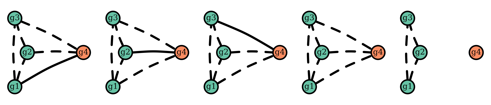

# Understand intra-episode siblings

This vignette expands upon a digression in [Understand posterior
probabilities](https://aimeertaylor.github.io/Pv3Rs/articles/posterior-probabilities.html).

[`compute_posterior()`](https://aimeertaylor.github.io/Pv3Rs/reference/compute_posterior.md)
sums over graphs with cliques of three or more intra-episode siblings
whenever the `MOIs` used contain values that exceed two. However, these
graphs only acquire non-zero likelihoods if the user specifies `MOIs`
that also exceed the diversity in the data `y`.

In any case, when MOI estimates are based on bulk parasite genetic data
(i.e., not single-cell data), groups of three or more non-half
intra-episode siblings collapse to groups of two (i.e., groups of three
or more non-half intra-episode siblings have no practical support)
because:

- MOI estimates based on maximum per-marker allele counts cannot exceed
  two for groups of three or more non-half siblings, because groups of
  non-half siblings can draw from at most two parental alleles per
  marker.

- MOI estimates based on heteroallelic marker counts likely don’t exceed
  two because the heteroallelic marker counts of groups of three or more
  non-half siblings cannot exceed that of the two parental genotypes
  from which they derive.

## Example of a group of four intra-episode siblings collapsing to two

Before demonstrating how intra-episode sibling groups collapse to pairs,
we write a function to simulate data on 200 markers all with the same
user-specified allelic richness (marker cardinality) for an enrolment
episode comprising a stranger plus a group of four siblings, two from
one oocyst, two from another, all drawing from the same two unrelated
parental genotypes, and a recurrence with one sibling. Technically, the
enrolment episode contains five genetically distinct genotypes and thus
has a MOI of five.

``` r
simulate_data <- function(marker_cardinality){
  
  # Magic numbers / quantities
  set.seed(5) # For reproducibility
  n_markers <- 200 # Number of markers
  n_strangers <- 3 # Number of stranger parasites
  n_oocysts <- 2 # Number of oocysts to draw from
  
  # Derived quantities
  alleles <- letters[1:marker_cardinality]
  markers <- paste0("m", 1:n_markers) # Marker names
  
  # Uniform allele frequencies 
  fs <- sapply(markers, simplify = FALSE, 
               function(m) setNames(rep(1/marker_cardinality, marker_cardinality), alleles))
  
  # Sample strangers
  strangers <- sapply(1:n_strangers, function(i) {
    sapply(markers, function(t) sample(names(fs[[t]]), size = 1, prob = fs[[t]]))
  })
  
  # Designate strangers
  parents <- strangers[, 1:2]
  
  # Map the markers to chromosomes. Assume equally sized chromosomes — reasonable
  # if and only if we later assume an equal number of crossovers per chromosome
  chrs_per_marker <- round(seq(0.51, 14.5, length.out = n_markers))
  
  # Sample parental allocations dependently per-oocyst 
  cs <- lapply(1:n_oocysts, function(o) recombine_parent_ids(chrs_per_marker))
  
  # Construct children from parental allocations 
  all_children <- lapply(1:n_oocysts, function(o) {
    oocyst_chidren <- sapply(1:n_markers, function(i) {
      sapply(1:ncol(cs[[o]]), function(j) parents[i,cs[[o]][i,j]])
    })
    colnames(oocyst_chidren) <- markers
    return(oocyst_chidren)
  })
  
  # Make enrolment infection
  enrol <- apply(rbind(all_children[[1]][1:2,], 
                       all_children[[2]][1:2,], 
                       strangers[,3]), 2, unique, simplify = F)
  
  # Make paired data
  data <- list(enrol = enrol, recur = as.list(all_children[[1]][1,]))
  
  return(list(data = data, fs = fs))
}
```

However, MOI estimates based on maximum per-marker allele counts are
three and one when markers are polyallelic:

``` r
polyallelic <- simulate_data(10) 
determine_MOIs(polyallelic$data)
#> [1] 3 1
```

And two and one when markers are biallelic:

``` r
biallelic <- simulate_data(2) 
determine_MOIs(biallelic$data)
#> [1] 2 1
```

Suppose we estimate MOIs of 3 and 1 for the biallelic data using an
external software that exploits heteroallelic marker counts, and input
those external estimates into
[`compute_posterior()`](https://aimeertaylor.github.io/Pv3Rs/reference/compute_posterior.md).
Providing data are simulated on a large number of markers (200 above),
we recover almost exactly the same posterior probabilities using both
the

- polyallelic data without user-specified MOIs
- biallelic data with user-specified MOIs of three and one

``` r
ppost <- suppressMessages(compute_posterior(y = polyallelic$data, 
                                            fs = polyallelic$fs, 
                                            return.logp = T))
bpost <- suppressMessages(compute_posterior(y = biallelic$data, 
                                            fs = biallelic$fs, 
                                            MOIs = c(3,1), return.logp = T))

ppost$marg
#>               C         L             I
#> recur 0.6666667 0.3333333 2.708985e-116
bpost$marg
#>               C         L            I
#> recur 0.6666663 0.3333337 4.625927e-18
```

However, the following graphs, which have cliques of three intra-episode
siblings, have zero likelihood given the polyallelic data:



Whereas, all relationships have non-zero likelihood given the biallelic
data:

``` r
llikes <- sapply(bpost$RGs, function(RG) RG$logp) # Extract log likelihoods
any(is.infinite(llikes)) # Are there any minus infinity log likelihoods?
#> [1] FALSE
```

## Contribution to upper bounds

The summation over graphs with cliques or three or more siblings is
possibly redundant given these graphs have no practical support. Even
when these graphs have zero likelihood, they contribute to maximum
probabilities of recrudescence / reinfection through the conditionally
uniform prior on graphs. However, for upper bounds on the probability of
reinfection / recrudescence given a single recurrence the contribution
is very small, especially for reinfection:


For recrudescence, 3 MOI vectors (circled in the plot above) result in
an absolute difference greater than 0.0175. They are those that feature
large MOIs (MOI vectors 5 2 , 6 2 , 7 1 ) and thus those whose graph
spaces include graphs with the largest cliques of intra-episode
siblings.

The contribution is likely even smaller for all vectors of three or more
MOIs that are computationally feasible under Pv3Rs, because their
constituent MOIs are necessarily less than 7 (recall that
computationally feasible MOI vectors are those that sum to at most
eight).
