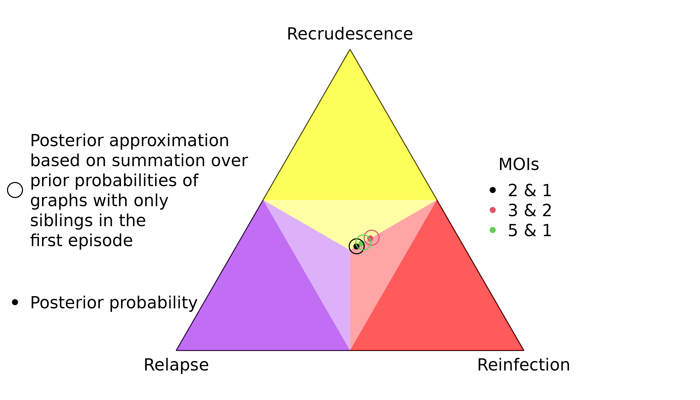
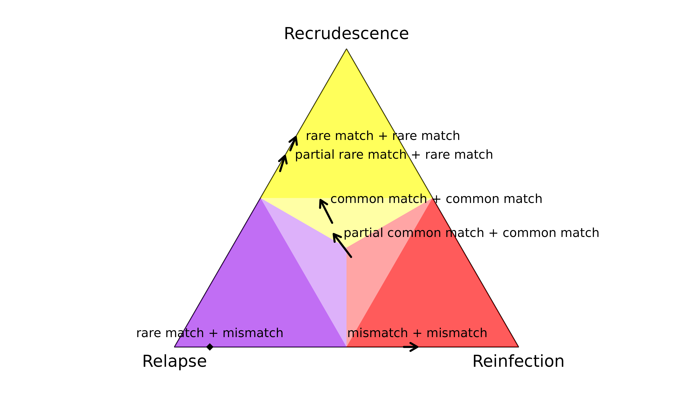
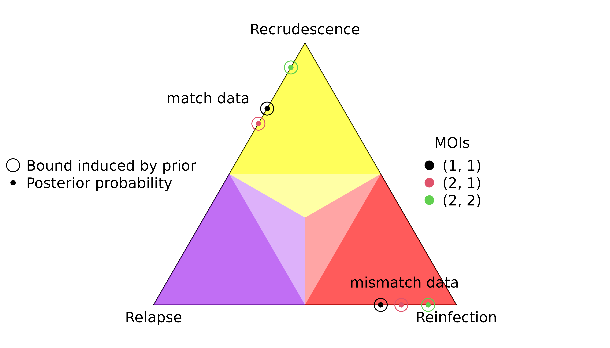
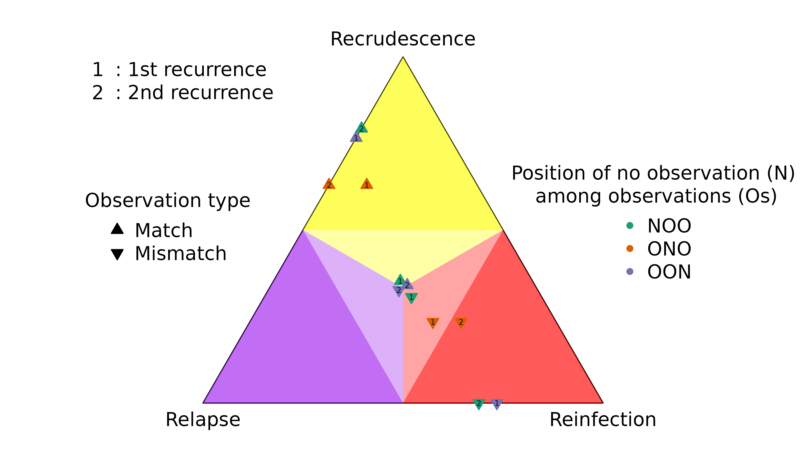

# Understand posterior probabilities

This vignette is a detailed sequel to
[`vignette("demonstrate-usage", "Pv3Rs")`](https://aimeertaylor.github.io/Pv3Rs/articles/demonstrate-usage.md).

## Summary of contents

We start by documenting the output of
[`compute_posterior()`](https://aimeertaylor.github.io/Pv3Rs/reference/compute_posterior.md)
when the statistical model underpinning it is well specified but

- [Data are missing](#missing)
- [Data are uninformative](#uniformative)
- [Data are limited to only one episode](#one-episode)
- [Data are incomparable across episodes](#incomparable)
- [Data are limited to only one marker](#one-marker)
- [Data are limited to only two markers](#two-markers)

[Given data on many markers](#many-markers), we then show under the well
specified model how maximum probabilities of recrudescence and
reinfection depend on

- [Per-episode multiplicities of infections](#mois)
- [Episode count](#epi-count)
- [Position of a recurrence in a sequence of episodes](#position)

and thus comment on how the above dependencies impact the
[interpretation of uncertainty](#uncertainty) given probable but
uncertain recrudescence and reinfection.

Finally, we summarise results on the output of
[`compute_posterior()`](https://aimeertaylor.github.io/Pv3Rs/reference/compute_posterior.md)
when the model is misspecified because of

- [Meiotic siblings](#meiotic)
- [Half siblings](#half)
- [Parent-child-like siblings](#parent-child-like)

More detailed results on sibling misspecification can be found in  
[RelationshipStudy](https://github.com/aimeertaylor/Pv3Rs/tree/main/vignettes/articles/RelationshipStudy).

We characterise model misspecification due to genotyping errors and
undetected alleles in \[ADD LINK\].

We have not yet characterised misspecification due to stranger parasites
with elevated relatedness:

- Stranger parasites that are related insofar as the population is
  related on average are accounted for: Allele frequency estimates
  encode population-level average relatedness locus-by-locus [\[Mehra et
  al. 2025\]](https://doi.org/10.1093/g3journal/jkaf018). Allele
  frequency estimates are plugged into the statistical model
  underpinning Pv3Rs. Providing they are computed from a sample drawn
  from the parasite population from which trial participants also draw,
  there is no need to compensate further for population-level average
  relatedness locus-by-locus. However, strong inter-locus dependence
  (linkage disequilibrium) could generate overconfident posterior
  probabilities.

- Stranger parasites that are related due to population structure (e.g.,
  proximity in space and time) will likely lead to the misclassification
  of reinfection as relapse / recrudescence. In our view, recurrence
  classification in the presence of population structure is best
  understood using complementary population-genetic and sensitivity
  analyses (e.g., identity-by-descent networks).

## Missing data

When data are entirely missing,
[`compute_posterior()`](https://aimeertaylor.github.io/Pv3Rs/reference/compute_posterior.md)
returns the prior.

``` r
fs = list(m1 = c("A" = 0.5, "B" = 0.5)) # Allele frequencies
y = list(enrol = list(m1 = NA), recur = list(m1 = NA)) # Missing data
suppressMessages(compute_posterior(y, fs))$marg # Posterior
#>               C         L         I
#> recur 0.3333333 0.3333333 0.3333333
```

When data are missing but the user provides MOIs that are incompatible
with recrudescence,
[`compute_posterior()`](https://aimeertaylor.github.io/Pv3Rs/reference/compute_posterior.md)
returns the prior re-weighted to the exclusion of recrudescence.

``` r
suppressMessages(compute_posterior(y, fs, MOIs = c(1,2)))$marg 
#>       C   L   I
#> recur 0 0.5 0.5
```

## Uniformative data

When data are uninformative because there is no genetic diversity,
[`compute_posterior()`](https://aimeertaylor.github.io/Pv3Rs/reference/compute_posterior.md)
returns the prior.

``` r
fs = list(m1 = c("A" = 1)) # Unit allele frequency: no genetic diversity
y = list(list(m1 = "A"), recur = list(m1 = "A")) # Data the only viable allele
suppressMessages(compute_posterior(y, fs))$marg # Posterior
#>               C         L         I
#> recur 0.3333333 0.3333333 0.3333333
```

## Data on only one episode

### Homoallelic data without user-specified MOIs: prior return

When only one episode has homoallelic data and the user does not specify
an MOI \> 1,
[`compute_posterior()`](https://aimeertaylor.github.io/Pv3Rs/reference/compute_posterior.md)
returns the prior.

``` r
fs = list(m1 = c("A" = 0.5, "B" = 0.5)) # Allele frequencies
y <- list(enrol = list(m1 = NA), recur1 = list(m1 = "A")) # No enrolment data
suppressMessages(compute_posterior(y, fs))$marg # Posterior
#>                C         L         I
#> recur1 0.3333333 0.3333333 0.3333333
```

### Heteroallelic data: prior proximity

When only one episode has heteroallelic data, the MOI under the model
necessarily exceeds one because the model assumes there are no false
alleles. The posterior is close to the prior but not equal to it because
the data are slightly informative: for relationship graphs with
intra-episode siblings, heteroallelic data limit summation over
identity-by-descent partitions to partitions with at least two cells for
the episode with data. The lower bound on the cell count increases with
the number of distinct alleles observed.

``` r
# Allele frequencies 
fs = list(m1 = c('A' = 0.25, 'B' = 0.25, 'C' = 0.25, 'D' = 0.25)) 

# MOI at enrolment increases with number of observed alleles:  
yMOI2 <- list(enrol = list(m1 = c('A','B')), recur = list(m1 = NA))
yMOI3 <- list(enrol = list(m1 = c('A','B','C')), recur = list(m1 = NA))
yMOI4 <- list(enrol = list(m1 = c('A','B','C','D')), recur = list(m1 = NA))
ys <- list(yMOI2, yMOI3, yMOI4)
do.call(rbind, lapply(ys, function(y) {
  suppressMessages(compute_posterior(y, fs))$marg
})) 
#>               C         L         I
#> recur 0.3292683 0.3414634 0.3292683
#> recur 0.3260870 0.3478261 0.3260870
#> recur 0.3248359 0.3503282 0.3248359

# MOI increases with external input:
MOIs <- list(c(2,1), c(2,2), c(3,2)) # user-specified MOIs
y <- list(enrol = list(m1 = c('A','B')), recur = list(m1 = NA)) # Data 
do.call(rbind, lapply(MOIs, function(x) {
  suppressMessages(compute_posterior(y, fs, MOIs = x))$marg
})) 
#>               C         L         I
#> recur 0.3292683 0.3414634 0.3292683
#> recur 0.3250000 0.3500000 0.3250000
#> recur 0.3334508 0.3330983 0.3334508
```

### Rare homoallelic data with user-specified MOIs exceeding 1: prior departure

If the data are homoallelic, but the user specifies MOIs greater than
one, and the observed allele is rare, the posterior departs from the
prior because rare intra-episode allelic repeats are more probable given
relationship graphs with intra-episode relatedness.

``` r
y <- list(enrol = list(m1 = 'A'), list(m1 = NA)) # Homoallelic data
MOIs <- list(c(2,1), c(3,2), c(5,1)) # Different MOIs with first MOI > 1
fs = list(m1 = c("A" = 0.01, "B" = 0.99)) # Rare observed allele
```



The per-graph likelihood is only appreciable for relationship graphs
where all distinct parasite genotypes in the first episode are siblings


## Data are incomparable across episodes

When there are data on multiple episodes but no common markers across
episodes,
[`compute_posterior()`](https://aimeertaylor.github.io/Pv3Rs/reference/compute_posterior.md)
behaves similarly to when data are limited to one episode:

- it returns the prior when data are homoallelic without user-specified
  MOIs \> 1,
- its output remains close to the prior when data are heteroallelic,
- its output departs from the prior when data are homoallelic and rare
  with user-specified MOIs \> 1.

``` r
# Allele frequencies
fs = list(m1 = c("A" = 0.01, "B" = 0.99), 
          m2 = c("A" = 0.01, "B" = 0.99)) 

# Data with an incomparable homoallelic call
y_hom <- list(enrol = list(m1 = "A", m2 = NA), 
              recur = list(m1 = NA, m2 = "A"))

# Data with an incomparable heteroallelic call
y_het <- list(enrol = list(m1 = c("A", "B"), m2 = NA), 
              recur = list(m1 = NA, m2 = c("A", "B")))

suppressMessages(compute_posterior(y_hom,fs))$marg # Prior return 
#>               C         L         I
#> recur 0.3333333 0.3333333 0.3333333
suppressMessages(compute_posterior(y_het,fs))$marg # Prior proximity
#>               C         L         I
#> recur 0.3370787 0.3595506 0.3033708
suppressMessages(compute_posterior(y_hom,fs,MOIs=c(2,2)))$marg # Prior departure
#>               C         L        I
#> recur 0.5142862 0.2183909 0.267323
```

## Data on only one marker

Given data on only one marker, the output of
[`compute_posterior()`](https://aimeertaylor.github.io/Pv3Rs/reference/compute_posterior.md)
depends on the observation type and the frequencies of the observed
alleles:

- A rare match is informative: it quashes the posterior probability of
  reinfection.
- A partial rare match is informative: it quashes the posterior
  probability of reinfection.
- A match with a common allele is not very informative: all states are
  possible *a posteriori*.
- A partial match with a common allele is not very informative: all
  states are possible *a posteriori*.
- A mismatch is informative: it quashes the posterior probability of
  recrudescence.

The latter demonstrates the sensitivity of recrudescence inference to
the assumption under the model that there are no genotyping errors: if a
genotyping error generates a single mismatch, the posterior probability
of recrudescence is quashed.


## Data on only two markers

Adding a second consistent observation generally strengthens inference
(see arrows in or entering regions of probability \> 0.5). An exception
is adding a common match to a common partial match, which adds little
information (central arrow). When a mismatch is added to a rare match
(diamond), relapse becomes the most probable state. This illustrates the
multiple-marker requirement of relapse inference.



## Data on many markers

Given non-zero prior probabilities, as the data increase with the number
of markers, posterior probabilities for a given recurrence under the
well specified model converge to either

1.  Relapse with posterior probability one when the data suggest the
    episode of interest is linked to previous episodes by regular
    sibling relationships

2.  Recrudescence with posterior probability less than one when the data
    suggest the episode of interest is linked to the directly preceding
    episode by clonal relationships

3.  Reinfection with posterior probability less than one when the data
    suggest the episode or interest is not linked to previous episodes
    by regular sibling or clonal relationships

Recrudescence / reinfection probabilities necessarily converge to
uncertain values because genetic data compatible with recrudescence /
reinfection are also compatible with relapse.

### Posterior bounds

Because we assume *a priori* that relationship graphs compatible with a
given recurrence state sequence are uniformly distributed, and because
relationship graphs compatible with sequences of recrudescence /
reinfection are a subset of those compatible with sequences of relapse,
prior-induced bounds on non-marginal posterior probabilities can be
computed *a priori* as a function of the prior on the recurrence state
sequences and the prior on the relationship graphs; see [Understand
graph-prior
ramifications](https://aimeertaylor.github.io/Pv3Rs/articles/graph-prior.pdf).

Because the probability mass function of a uniformly distributed
discrete random variable depends on the size of its support, the prior
on uniformly distributed graphs (and resulting prior-induced posterior
bounds) depends on the size of the graph space. The size of this space
is determined by the size of the graphs it contains, which have as many
vertices as there are parasite genotypes within and across episodes. As
such, graph size depends on the number of episodes and the per-episode
MOIs, which vary across trial participants.

Using rare matched and mismatched data on 100 markers, we illustrate how
prior-induced posterior bounds for a single recurrence depend on
per-episode MOIs. We also demonstrate how maximum marginal probabilities
of recrudescence / relapse depend on episode counts by adding
recurrences with no recurrent data. However, these maxima rely on
knowing that recurrent data are absent for all but the first recurrence
and thus are not computable *a priori*.

We start by defining some variables that will be used repeatedly in the
following code chunks.

``` r
marker_count <- 100 # Number of markers
ms <- paste0("m", 1:marker_count) # Marker names 
all_As <- sapply(ms, function(t) "A", simplify = F) # As for all markers
all_Bs <- sapply(ms, function(t) "B", simplify = F) # Bs for all markers
no_data <- sapply(ms, function(t) NA, simplify = F) # NAs for all markers
fA <- 0.01 # Frequency of rare allele
fB <- 1 - fA # Frequency of common allele
fs <- sapply(ms, function(m) c("A"=fA, "B"=fB), simplify = FALSE) # Frequencies
```

### Increasing per-episode MOIs

``` r
MOIs <- list(c(1,1), c(2,1), c(2,2)) 
y_match <- list(enrol = all_As, recur = all_As)
y_mismatch <- list(enrol = all_As, recur = all_Bs)
```



The posterior probabilities increase with increasing graph size, but
only if the MOIs are balanced in the case of recrudescence.

#### Digression: counts of intra-episode siblings

To increase per-episode MOIs, we can do as above and increase
user-specified MOIs without changing the data, or we can increase the
allelic diversity of the data, s.t. MOIs modelled under Pv3Rs increase
without user-specified MOIs. Either way, we get the same maximum
probabilitie, but the graph likelihoods change:


For the homoallelic data with elevated user-specified MOIs, all
intra-episode parasites in maximum likelihood graphs are siblings. For
the heteroallelic data, all intra-episode parasites in maximum
likelihood graphs are strangers.

One upshot of this is that maximum probabilities could be arbitrarily
increased by increasing counts of intra-episode siblings. Since siblings
are not independent, these maxima arguably should not increase beyond
two siblings per episode. Under the Pv3Rs model with realistic MOI
estimates, groups of three or more siblings are effectively treated as
pairs; see [Understand intra-episode
siblings](https://aimeertaylor.github.io/Pv3Rs/articles/intra-episode-siblings.html).

END OF DIGRESSION

### Increasing episode counts

Recurrences can be added without adding data

``` r
ys_match <- list("1_recurrence" = list(enrol = all_As, 
                                       recur1 = all_As),
                 "2_recurrence" = list(enrol = all_As, 
                                       recur1 = all_As,
                                       recur2 = no_data),
                 "3_recurrence" = list(enrol = all_As, 
                                       recur1 = all_As,
                                       recur2 = no_data,
                                       recur3 = no_data))

ys_mismatch <- list("1_recurrence" = list(enrol = all_As, 
                                          recur1 = all_Bs),
                    "2_recurrence" = list(enrol = all_As, 
                                          recur1 = all_Bs,
                                          recur2 = no_data),
                    "3_recurrence" = list(enrol = all_As, 
                                          recur1 = all_Bs,
                                          recur2 = no_data,
                                          recur3 = no_data))
```

The marginal probability that the first recurrence is a recrudescence /
reinfection depends on the total number of recurrences:


An example of how recrudescence probabilities converge to their maxima
over 1, 2, 5 and 100 markers:


Recall that the above maxima are not bounds imposed by the prior: they
are based on knowledge that there are no recurrent data on all but the
first recurrence; see [Understand graph-prior
ramifications](https://aimeertaylor.github.io/Pv3Rs/articles/graph-prior.pdf).

### Position in a sequence

Because the distribution over relationship graphs is not invariant to
different orderings of states in a sequence (more graphs are compatible
with a reinfection at the beginning versus the end of a sequence of
three episodes, for example), the position of a recurrence in a sequence
affects its per-recurrence posterior probability. These examples also
highlight why, under a well-specified model, jointly modelling data
across more than two episodes is preferable to analysing episodes
pairwise.

The effect of position is negligible when all episodes have the same
data on many markers:

``` r
y <- list(enrol = all_As, 
          recur1 = all_As, 
          recur2 = all_As, 
          recur3 = all_As)
suppressMessages(compute_posterior(y, fs))$marg
#>                C         L            I
#> recur1 0.7720588 0.2279412 5.585675e-23
#> recur2 0.7720588 0.2279412 5.316220e-23
#> recur3 0.7720588 0.2279412 5.044004e-23
```

Instead, consider sequences of episodes with observations (Os) and
episodes with no data (Ns):

``` r
ys_match <- list("NOO" = list(enrol = no_data, 
                              recur1 = all_As,
                              recur2 = all_As),
                 "ONO" = list(enrol = all_As, 
                              recur1 = no_data,
                              recur2 = all_As),
                 "OON" = list(enrol = all_As, 
                              recur1 = all_As,
                              recur2 = no_data))

ys_mismatch <- list("NOO" = list(enrol = no_data, 
                                 recur1 = all_As,
                                 recur2 = all_Bs),
                    "ONO" = list(enrol = all_As, 
                                 recur1 = no_data,
                                 recur2 = all_Bs), 
                    "OON" = list(enrol = all_As, 
                                 recur1 = all_Bs,
                                 recur2 = no_data))
```



#### Highly informed recurrences

The first recurrence in the sequence O**O**N (upward purple 1 triangle)
has a slightly lower probability of recrudescence than second recurrence
in the sequence NO**O** (upward green 2 triangle) despite both
recurrences having the same rare observations that match the directly
preceding episode.

The first recurrence in the sequence O**O**N (downward purple 1
triangle) has a slightly higher probability of reinfection than the
second recurrence in the sequence NO**O** (downward green 2 triangle)
despite both recurrences having the same observations that mismatch the
directly preceding episode.

#### Weakly and uninformed recurrences

Unsurprisingly, the posterior of the first recurrence in the sequence
N**O**O is close to the prior (it has no preceding data), likewise for
the second recurrence in the sequence of OO**N** (it has no data). More
surprisingly, the posterior of the first recurrence of the sequence
O**N**O is not close to the prior, despite having no data. On closer
inspection, this is not so surprising for reasons explained below.

For match data (upward triangles), strong evidence for a clonal edge
between episodes one and three in **O**N**O** is incompatible with all
recurrence sequences ending with reinfection *and* reinfection followed
by recrudescence, informing strongly the second recurrence and weakly
the first recurrence. By comparison, strong evidence for a clonal edge
between episodes two and three in N**OO** is incompatible with all
sequences of recurrences ending with reinfection, informing the second
recurrence only; likewise, strong evidence for a clonal edge between
episodes one and two in **OO**N is incompatible with all sequences of
recurrences starting with reinfection, informing the first recurrence
only.

``` r
epsilon <- .Machine$double.eps # Very small probability
names(which(suppressMessages(compute_posterior(y = ys_match[["ONO"]], fs))$joint < epsilon))
#> [1] "IC" "CI" "LI" "II"
names(which(suppressMessages(compute_posterior(y = ys_match[["NOO"]], fs))$joint < epsilon))
#> [1] "CI" "LI" "II"
names(which(suppressMessages(compute_posterior(y = ys_match[["OON"]], fs))$joint < epsilon))
#> [1] "IC" "IL" "II"
```

On close inspection the upward orange 1 triangle makes intuitive sense:
if you know a first recurrence is followed by a second MOI = 1
recurrence that is a clone of the MOI = 1 enrolment episode, it is very
unlikely the second recurrence is a clone drawn from a new mosquito as
it would be if it were a recrudescence of a reinfection. Thus, the
enrolment and second recurrence data inform the first recurrence,
causing its posterior to deviate from the prior even though it has no
data.

The explanation for mismatch data (downward triangles) in the sequence
ONO is similar to that for match data: strong evidence for a stranger
edge between episodes one and three is incompatible with a double
recrudescence, so the posterior of the first recurrence (downward orange
1 triangle) deviates from the prior despite the first recurrence having
no data.

``` r
epsilon <- .Machine$double.eps # Very small probability
names(which(suppressMessages(compute_posterior(y = ys_mismatch[["ONO"]], fs))$joint < epsilon))
#> [1] "CC"
names(which(suppressMessages(compute_posterior(y = ys_mismatch[["NOO"]], fs))$joint < epsilon))
#> [1] "CC" "LC" "IC"
names(which(suppressMessages(compute_posterior(y = ys_mismatch[["OON"]], fs))$joint < epsilon))
#> [1] "CC" "CL" "CI"
```

## Interpreting uncertainty

Uncertain posterior probabilities can be uncertain for two reasons that
are not mutually exclusive:

1.  more data are needed
2.  the states are not fully identifiable

It is also important to bear in mind the above-illustrated facts that,
under the Pv3Rs model, trial participants with different [per-episode
MOIs](#mois) and [episode counts](#epi-count) have different maximum
probabilities of recrudescence / reinfection. For example, if we use a
common threshold of 0.8 to classify probable reinfection assuming
recurrence states are equally likely *a priori*, we can discount *a
priori* all trial participants with a single monoclonal recurrence
following a monoclonal enrolment episode because their posterior
reinfection probabilities will never exceed 0.75, even if their data are
highly informative of reinfection:

``` r
y <- list(enrol = all_As, recur = all_Bs)
fs <- sapply(ms, FUN = function(m) c("A" = 0.5, "B" = 0.5), simplify = FALSE)

# Using the default uniform prior on recurrence states
suppressMessages(compute_posterior(y, fs))$marg
#>       C    L    I
#> recur 0 0.25 0.75

# Using a non-uniform prior on recurrence states
prior <- as.matrix(data.frame("C" = 0.25, "L" = 0.25, "I" = 0.5))
suppressMessages(compute_posterior(y, fs, prior))$marg
#>       C         L         I
#> recur 0 0.1428571 0.8571429
```

And that, for a given trial participant, the probability of
recrudescence / reinfection depends on its [position within a
sequence](#position), especially if one or more episodes has no data.

## Meiotic siblings

### Methods

We simulated data and generated results for an initial infection
containing two or three meiotic siblings and a recurrent

- stranger
- clone
- regular sibling
- meiotic sibling

Posterior probabilities are computed assuming recurrence states are
equally likely *a priori*.

### Results

When the initial infection contains two meiotic siblings
[`compute_posterior()`](https://aimeertaylor.github.io/Pv3Rs/reference/compute_posterior.md)
is well behaved with maximum likelihood on the true relationship graph
(not shown). Posterior probabilities converge to

- probable reinfection when the recurrent parasite is a stranger,
- probable recrudescence when the recurrent parasite is a clone,
- certain relapse when the recurrent parasite is a regular sibling,
- certain relapse when the recurrent parasite is a meiotic sibling.


When the initial infection contains three meiotic siblings and the
recurrent parasite is either a stranger or a clone, posterior
probabilities converge correctly to probable reinfection and probable
recrudescence, respectively, but with maximal values given by graphs
over relationships between two, not three, parasites in the initial
infection.


Relationship graphs (not shown) are wrong for two reasons:

- all the relationship graphs have two, not three, parasites in the
  initial infection because there are at most two alleles per marker.
  Although technically incorrect, this behaviour is arguably desirable;
  see the digression in the above section [Data on many
  markers](#many-markers).
- the highest likelihood relationship graphs have stranger parasites in
  the initial episode because prevalence data from three or four meiotic
  siblings are identical to bulk data from the parents, who are
  strangers.

We can force the graphs to have three distinct parasites in the initial
episode by specifying external MOIs. Doing so recovers maximum
likelihood on true relationship graphs. However, the correct MOIs are
unknowable in practice: a collection of siblings from two parents can
only ever be as diverse as the two parents.

When the initial infection contains three meiotic siblings and the
recurrent parasite is a regular or meiotic sibling, posterior
probabilities converge to probable recrudescence with maximum likelihood
on graphs with a clonal edge to the sibling relapse, and either two
stranger parasites in the initial episode when no external MOIs are
specified, or three sibling parasites in the initial episode when the
correct MOIs (unknowable in practice) are provided externally.


## Half siblings

### Methods

We simulated data for three half siblings: two in an initial episode,
the third in a recurrence:

- child of parents 1 and 2 in the initial episode
- child of parents 1 and 3 in the initial episode
- child of parents 2 and 3 in the recurrence

We explored two scenarios: one where all parental parasites draw from
the same allele distribution. Another with admixture where parent 1
draws alleles disproportionally to parents 2 and 3. The admixture
scenario is improbable. We explore it because it is a worse case
scenario: it is contrived to maximally hamper relapse classification.

### Results

In general, when parental parasites draw from the same allele
distribution, the frequency of certain relapse increases erratically
with the number of markers genotyped.

For this particular case where there are three equifrequent alleles per
marker, we can show theoretically that the system behaves erratically
because a small perturbation to the ratio of observations (all alleles
match across the three half siblings, all alleles are different,
intra-episode alleles match, inter-episode alleles match) can lead to a
large deviation in the odds of relapse versus reinfection; see
[Understand half-sibling
misspecification](https://aimeertaylor.github.io/Pv3Rs/articles/half-siblings.pdf).
The purple, red, and green trajectories below have higher than the
expected 0.5 intra-to-inter match ratios; moreover, the purple
trajectory’s intra-to-inter match ratio consistently exceeds
$0.5 \times \text{log}_{2}\left( \frac{2}{5} \right)$, a condition found
theoretically to concentrate posterior probability on reinfection under
certain conditions; again, see [Understand half-sibling
misspecification](https://aimeertaylor.github.io/Pv3Rs/articles/half-siblings.pdf).


When intra-episode parasites systematically share rare alleles
(admixture AND imbalanced allele frequencies), the frequency of probable
reinfection increases erratically with the number of markers genotyped.

 In
both scenarios, the likelihood of the true graph with siblings within
and across episodes is quashed as soon as distinct alleles from all
three parents are observed at a given marker. In general,

- when all parasites draw from the same allele distribution, the maximum
  likelihood graphs are the two with one inter-episode sibling edge.
- when intra-episode parasites systematically share rare alleles, the
  maximum likelihood graph is the one with one intra-episode sibling
  edge.

## Parent-child-like siblings

### Methods

We simulated data for three parent-child-like siblings:

- child of selfed parent 1 in the initial episode
- child of parents 1 and 2 in the initial episode
- child of selfed parent 2 in the recurrence

Aside: the alternative with both children of selfed parents in the
initial episode is equivalent to the meiotic case above with three
mieotic siblings in the initial episode because prevalence data from
three meiotic siblings is equivalent to prevalence data from two
stranger parents and leads to probable recrudescence rather than certain
relapse with the number of markers genotyped.

As for half-siblings, we explored two scenarios: one where all parental
parasites draw from the same allele distribution. Another with admixture
where parent 1 draws alleles disproportionally to parent 2. The
admixture scenario is improbable. We explore it because it is a worse
case scenario: it is contrived to maximally hamper relapse
classification.

### Results

When parental parasites draw from the same allele distribution, the
frequency of certain relapse increases erratically with the number of
markers genotyped.


When intra-episode parasites systematically share rare alleles
(admixture AND imbalanced allele frequencies), the frequency of probable
reinfection increases erratically with the number of markers genotyped.


In general, when all parasites draw from the same allele distribution,
the maximum likelihood graph is the true graph with siblings within and
across episodes. Meanwhile, when intra-episode parasites systematically
share rare alleles, the maximum likelihood graph is the one with one
intra-episode sibling edge.
