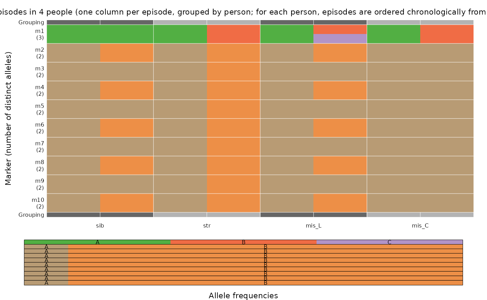
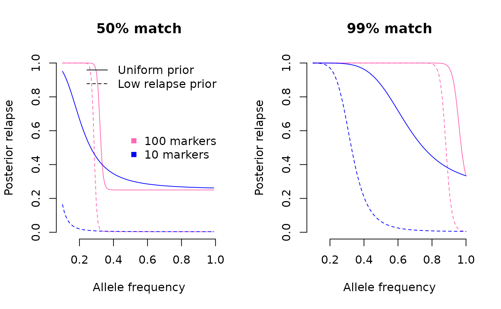
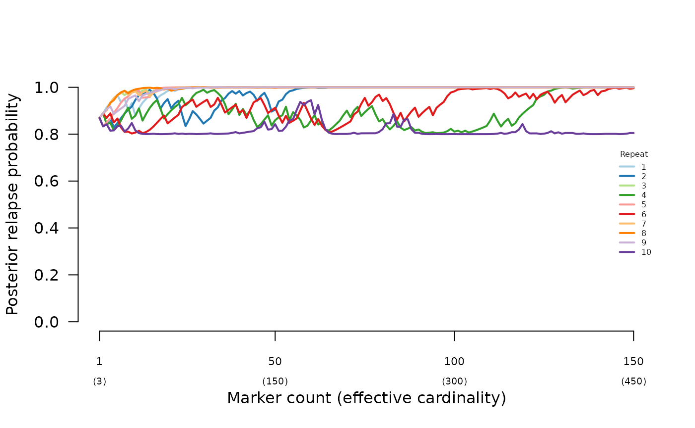
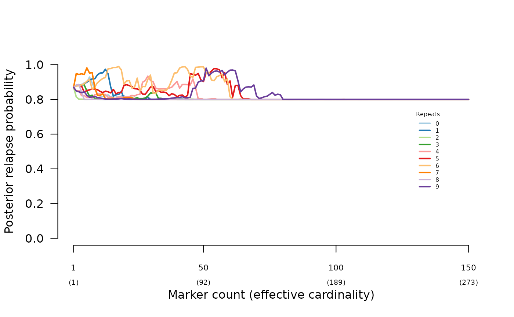

# Understand prior impact

## Summary

In a very limited setting (single recurrence, MOIs of one or two per
episode, extreme and contrived data and allele frequencies), the
following two questions are explored.

1.  What is the impact of the prior?
2.  Can the prior offset misspecification?

In summary: the prior does impact the posterior and can offset
misspecification, but not always. More specifically,

1.  A high-relapse prior can generate a high-relapse posterior despite
    data consistent with reinfection.
2.  A high-relapse prior can rescue the relapse posterior when data are
    consistent with siblings but break the assumption that siblings draw
    their alleles from at most two parental gametes.
3.  A high-recrudescence prior cannot rescue the recrudescence posterior
    when data are consistent with clones with a single miss-match, e.g.,
    due to genotyping error.

For data consistent with relapse, the results are more nuanced. In
summary, the posterior transitions between probable relapse and probable
reinfection with the increasing frequency of the allele that matches
across episodes. When the Pv3Rs model is fit to only 10 markers, the
transition is gradual, and a low-relapse prior can lower the relapse
posterior when it is otherwise high. When the Pv3Rs model is fit to 100
markers, the transition is is abrupt. A low-relapse prior can generate a
low-relapse posterior when it is otherwise high, but only within a
narrow window of frequency (this window might differ for more realistic
data).

``` r

library(Pv3Rs)
```

## Some contrived examples on which insight is based

### Generate synthetic data, frequencies and priors

``` r

marker_count <- 100 # Number of markers
ms <- paste0("m", 1:marker_count) # Marker names

# Generate per-episode data 
all_As <- sapply(ms, function(t) "A", simplify = F)
all_Bs <- sapply(ms, function(t) "B", simplify = F)
BAAAAA <- all_As; BAAAAA[["m1"]] <- "B"
ABABAB <- sapply(ms, function(t) ifelse(gtools::odd(as.numeric(gsub("m","",t))), "A", "B"), simplify = F)
BC_BABAB <- ABABAB; BC_BABAB[["m1"]] <- c("B", "C") # Three alleles at m1

# Generate paired-episode data 
sib <- list(enrol = all_As, recur = ABABAB) # Perfect mosaic
str <- list(enrol = all_As, recur = all_Bs) # Perfect mismatch
mis_L <- list(enrol = all_As, recur = BC_BABAB) # Perfect mosaic with draw from three alleles at m1
mis_C <- list(enrol = all_As, recur = BAAAAA) # Perfect mosaic with draw from three alleles at m1

# Generate frequencies
f_rare <- 0.1 # Frequency of rare allele
fs_rareA <- c(list(m1 = c("A" = 1/3, "B" = 1/3, "C" = 1/3)),  
              sapply(ms[-1], function(m) c("A" = f_rare, "B" = 1 - f_rare), simplify = FALSE))

# Specify priors
prior_hi_L <- array(c(0, 0.99, 0.01), dim = c(1,3), dimnames = list(NULL, c("C", "L", "I")))
prior_hi_I <- array(c(0, 0.01, 0.99), dim = c(1,3), dimnames = list(NULL, c("C", "L", "I")))
prior_hi_C <- array(c(0.95, 0.025, 0.025), dim = c(1,3), dimnames = list(NULL, c("C", "L", "I")))
```

### Plot sythetic data (first 10 of 100 markers)



### Compare posterior with and without non-uniform priors

#### High-relapse prior increases relapse posterior when data are consistent with reinfection:

``` r

suppressMessages(compute_posterior(str, fs_rareA))$marg
```

    ##       C    L    I
    ## recur 0 0.25 0.75

``` r

suppressMessages(compute_posterior(str, fs_rareA, prior_hi_L))$marg
```

    ##       C         L          I
    ## recur 0 0.9705882 0.02941176

#### High-relapse prior rescues relapse posterior when data are consistent with half-sib misspecification:

``` r

suppressMessages(compute_posterior(mis_L, fs_rareA))$marg
```

    ##       C         L         I
    ## recur 0 0.1818182 0.8181818

``` r

suppressMessages(compute_posterior(mis_L, fs_rareA, prior_hi_L))$marg
```

    ##       C         L          I
    ## recur 0 0.9565217 0.04347826

#### High-recrudescence prior cannot rescue recrudescence posterior given mismatched data:

``` r

suppressMessages(compute_posterior(mis_C, fs_rareA))$marg
```

    ##       C L            I
    ## recur 0 1 3.035603e-73

``` r

suppressMessages(compute_posterior(mis_C, fs_rareA, prior_hi_C))$marg
```

    ##       C L            I
    ## recur 0 1 3.035603e-73

#### High-reinfection prior sometimes impacts an otherwise high-relapse posterior:

High-reinfection prior lowers the posterior probability of relapse when
the data are consistent with relapse and when there are 10 markers (blue
lines). When there are 100 markers (pink lines) the prior has an impact
in the vicinity of the frequency leading to abrupt change between
probable relapse and probable reinfection. The allele that matches has
to have a very high frequency in the case of data that are almost
consistent with recrudescence.



## Rescuing misspecification

The simulated data used to demonstrate the impact of half sibling
misspecification in [Understand posterior
probabilities](https://aimeertaylor.github.io/Pv3Rs/articles/posterior-probabilities.html#half)
were re-analysed using a high-relapse prior (0.9 relapse), recovering
high-relapse posteriors:




